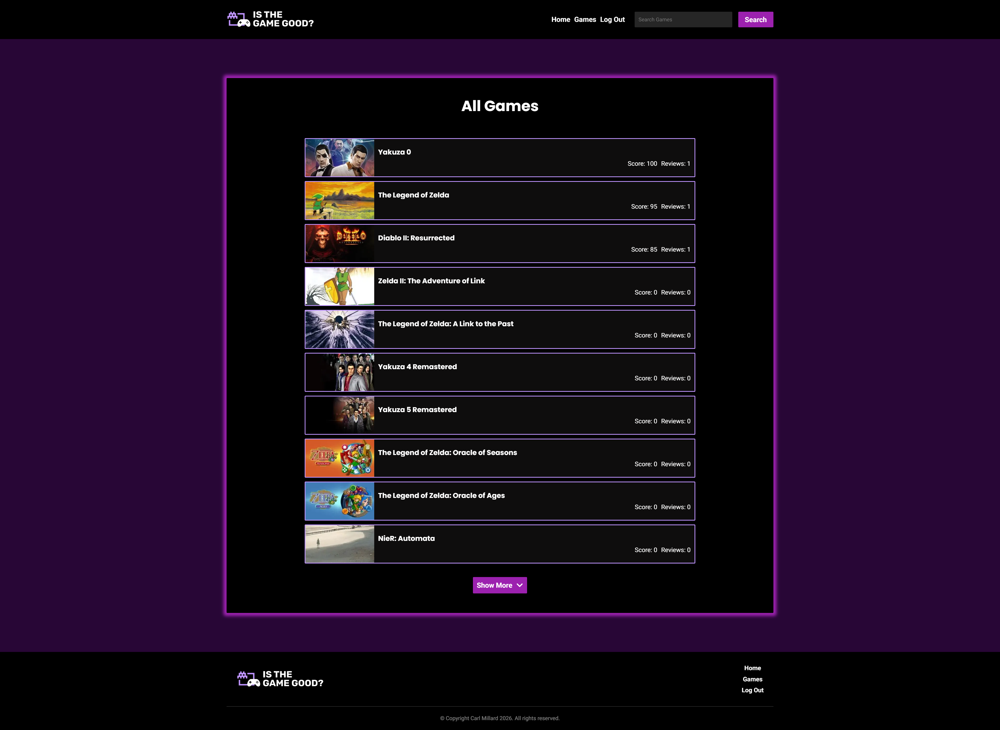

# 🎮 Is the game good? 

A small game-focused website where users can browse video game listings and leave reviews.
Also, users can comment on each other's reviews and leave "helpful" likes. 

Built as a personal project to practice modern frontend development and UI design in React, Next.js and TypeScript.

## Features
- Browse available game listings
- Each game has its own page with title, release date, artwork and screenshots
- Fully responsive layout
- Ability to create user accounts 
- Can leave reviews and scores on games
- Can comment on and like other reviews
- Special admin-only page for adding new games also available

## Tech stack 
- HTML
- CSS/SCSS
- JavaScript/JSX
- TypeScript
- React
- Next.js 

## Installation 
- To run on your own machine, you will need firebase and twitch IGDB key/credentials
- npm install (dependencies)
- npm run dev 
